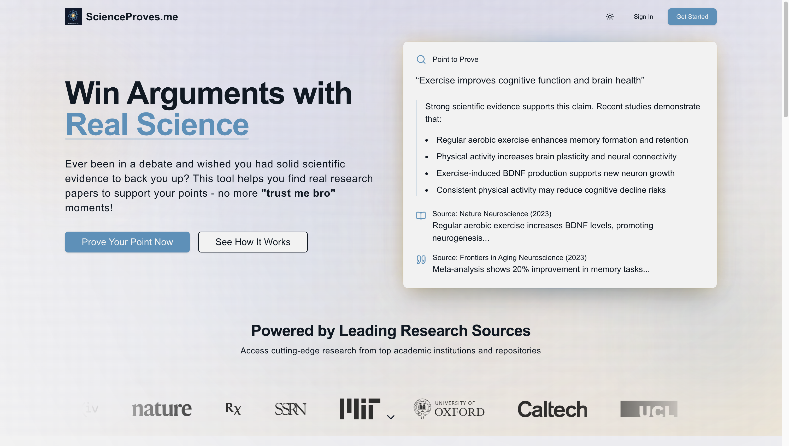

<div align="center">

# 🧬 ScienceProves.Me

[](https://choosealicense.com/licenses/mit/)
[](https://www.python.org/downloads/)
[](https://nextjs.org/)

> Because "Trust me bro" isn't a valid source anymore.

Your AI-powered research assistant that provides scientifically-backed answers by analyzing millions of academic papers in real-time.

[Live Demo](https://scienceproves.me) · [Report Bug](https://github.com/Bilalkamal/ScienceProves.Me/issues) · [Request Feature](https://github.com/Bilalkamal/ScienceProves.Me/issues)



</div>

## 🎯 Overview

ScienceProves.Me revolutionizes research by providing instant, scientifically-backed answers to your questions. Our advanced RAG (Retrieval-Augmented Generation) system analyzes millions of academic papers in real-time, ensuring accurate and verifiable responses.

## ✨ Key Features

<div align="center">

| Feature | Description |
|---------|-------------|
| 🔍 **Pure Science** | Only peer-reviewed papers and trusted scientific sources |
| 🚀 **Real-time RAG** | Advanced retrieval-augmented generation for accurate answers |
| 📚 **Full Transparency** | Every answer includes citations and links to original research |
| ✅ **No Hallucinations** | Multi-stage verification ensures factual accuracy |
| 💫 **Modern UX** | Sleek, responsive interface with real-time streaming responses |

</div>

## 🛠️ Technology Stack

<div align="center">

### Frontend
[](https://nextjs.org/)
[](https://www.typescriptlang.org/)
[](https://tailwindcss.com/)
[](https://clerk.dev/)

### Backend
[](https://www.python.org/)
[](https://fastapi.tiangolo.com/)
[](https://www.postgresql.org/)
[](https://supabase.com/)

</div>

## 🚀 Getting Started

Ready to dive in? Check out our detailed setup guides:
- [Frontend Documentation](Frontend/README.md)
- [Backend Documentation](Backend/README.md)

## 📁 Project Architecture

```bash
.
├── Frontend/               # Next.js web application
│   ├── src/
│   │   ├── app/             
│   │   │   ├── ask/
│   │   │   ├── dashboard/
│   │   │   └── history/
│   │   ├── components/      
│   │   │   ├── ui/
│   │   │   ├── nav-bar.tsx
│   │   │   └── footer.tsx
│   │   ├── hooks/          
│   │   └── lib/            
│   ├── public/             
│   ├── next.config.ts
│   └── package.json
│
└── Backend/                  # FastAPI + RAG system
    ├── Data-ingestion/      
    │   └── data-ingestion.ipynb
    ├── SQL/                 
    │   ├── create_documents_table.sql
    │   ├── create_queries_table.sql
    │   └── match_documents.sql
    ├── app/                 
    │   ├── main.py
    │   ├── core/config.py
    │   ├── db/manager.py
    │   └── services/request_manager.py
    ├── rag/                 
    │   ├── rag.py
    │   ├── rag_embeddings.py
    │   ├── rag_llm.py
    │   └── rag_retriever.py
    ├── requirements.txt
    └── vercel.json
```

## 🛣️ Future Roadmap

- [ ] Integration with PubMed and Nature databases
- [ ] Question Caching for faster responses
- [ ] Web Search responses added to DB
- [ ] Advanced citation management system

## 🤝 Contributing

We welcome contributions! Feel free to:
- Open issues for bugs or suggestions
- Submit pull requests
- Share feedback and ideas

## 🙏 Acknowledgments

Special thanks to our amazing community and partners:
- [Cornell University and arXiv](https://arxiv.org/) for the extensive research papers dataset
- [@JasonGoodison](https://youtube.com/@JasonGoodison) for the RAG app concept
- [@mckaywrigley](https://x.com/mckaywrigley) for mentorship in RAG development
- [@RLanceMartin](https://x.com/RLanceMartin) and [@LangChainAI](https://x.com/LangChainAI) for implementation ideas
- [Pixegami](https://www.pixegami.io/) for inspiration

## 📬 Connect With Us

<div align="center">

[](https://scienceproves.me)
[](mailto:Hello@ScienceProves.Me)
[](https://github.com/Bilalkamal)

</div>

## 📜 License

This project is licensed under the MIT License - see the [LICENSE](LICENSE) file for details.


